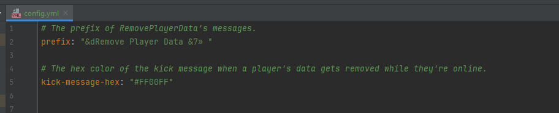
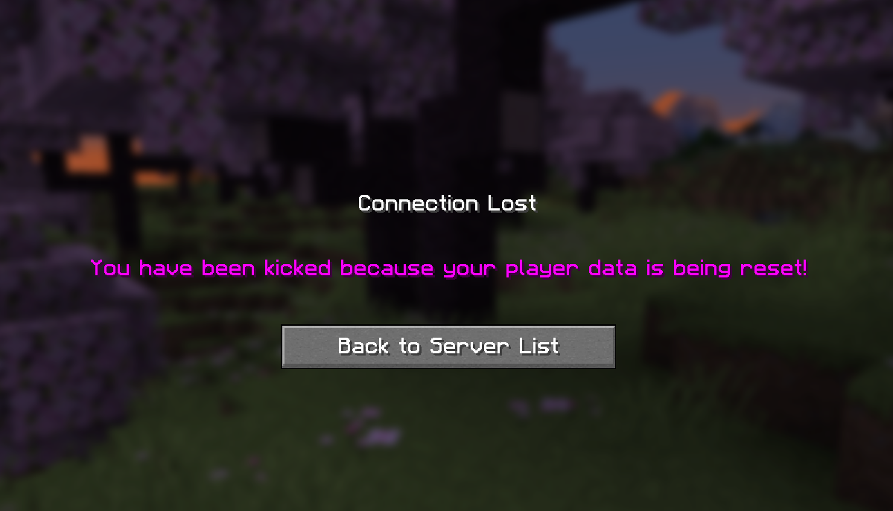

# RemovePlayerData
A Minecraft server plugin to delete a user's playerdata!

Want to easily remove a player's data from your server to make it as if their next join is the first time joining the server?

Look no further! 

## Commands:
- `/removeplayerdata <username/reload>`
  - Aliases:
    - `/rpd`
    - `/deleteplayerdata`
    - `/dpd`

## Permissions:
- `removeplayerdata.use`: Permission to use the plugin at all.
- `removeplayerdata.reload`: Permission to reload RemovePlayerData's config.

## Screenshots:
### Config:

### Kick Message:

### Usage:
